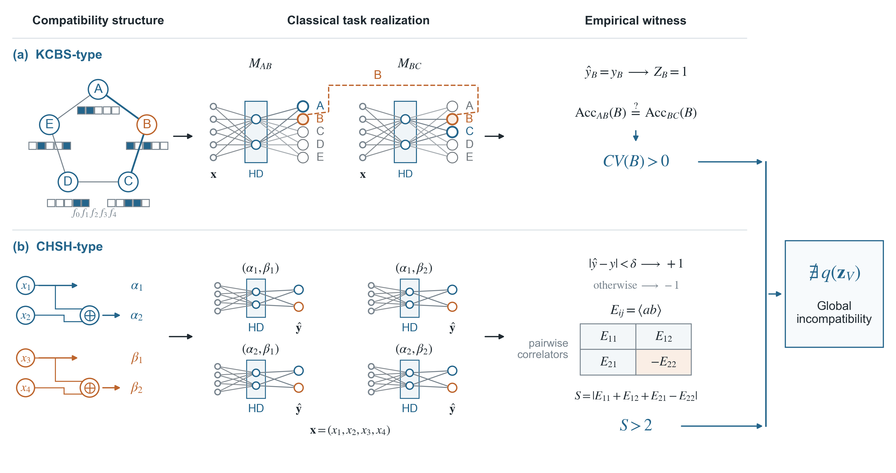
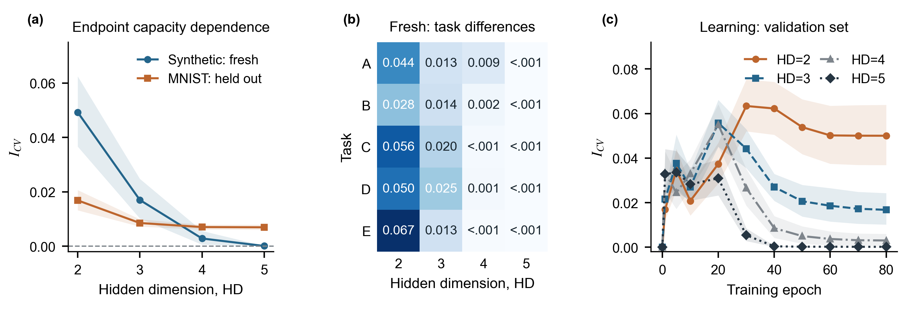
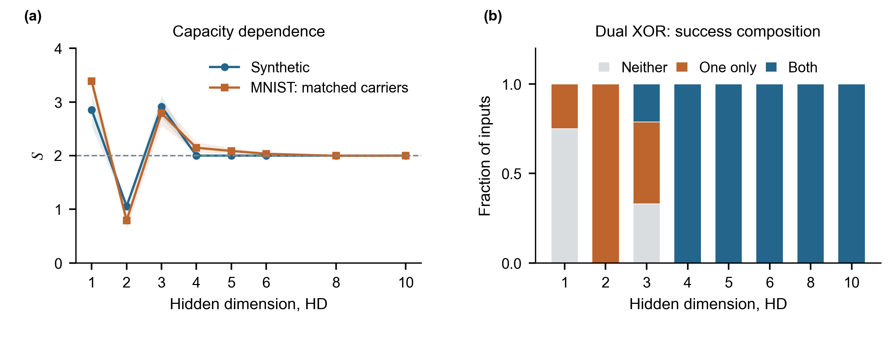

# Multitask probabilistic compatibility: selected figure data

Selected plotting materials for *Learning-dependent global probabilistic compatibility in multitask neural networks*, by Yi Zhou and Yuexian Hou.

This repository contains three main-figure PNGs, five processed plotting-data CSVs, and scripts for redrawing the main figures. It is a **selected figure-data release**, not the complete experimental dataset or training implementation.

## Contents

- `figures/`: Figure 1 at 450 dpi; Figures 2 and 3 at 400 dpi.
- `result/`: five CSVs supporting the main figures; no archive extraction is needed.
- `RESULTS_INDEX.md`: figure-to-data mapping and data-field descriptions.

Full experimental protocols, appendix-table datasets, training code, model checkpoints, and individual prediction arrays are not included. In particular, MNIST curves are provided as saved means and confidence intervals, not their underlying repeat-level observations. These materials support redrawing the figures, not recomputing every interval or independently reproducing all manuscript results. Publication or acceptance is not implied.

## Figures

